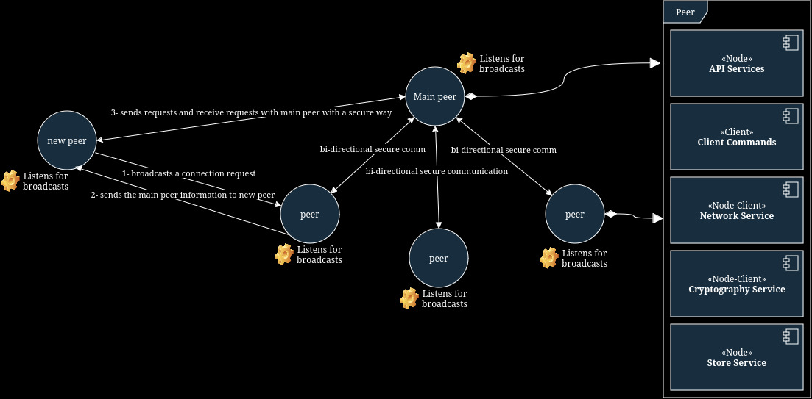
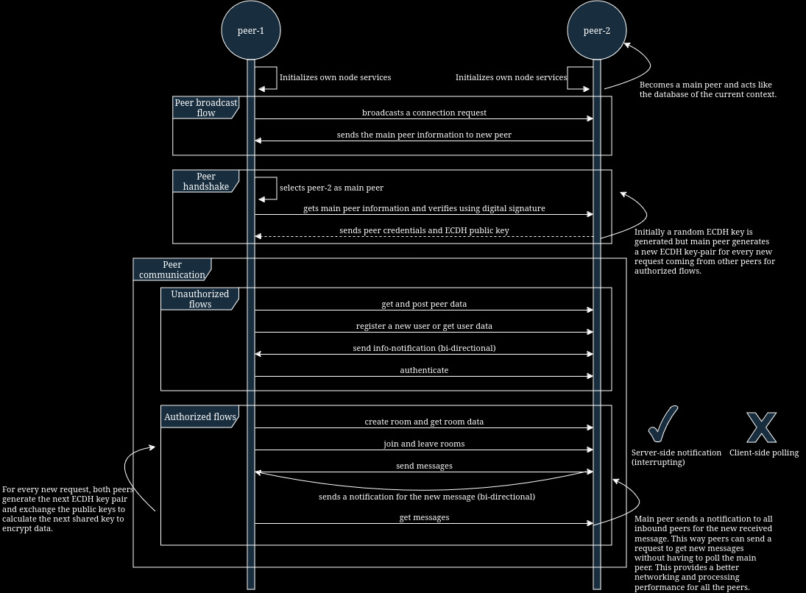

# group-messaging-in-go
I have been developing this program to utilize a messaging interface for my own local networks. I used a P2P approach on top of HTTP. This lets us treat this program as both a peer and a centralized server. How we use it merely depends on the use case. It is possible to use a CLI interface as well as to use an HTTP tool such as cURL. It must be noted that, in P2P programs, clients are responsible to encrypt their own data as well as agreeing on particular key exchange algorithms. This development follows this notion by heart.

## Simple flow of the program
1. A requestor peer passes a public key and a signature to serving peer to initiate a handshake.

2. The serving peer validates the signature with the public key of the requestor peer by PKCS and initializes a new session and authentication key for the peer. Then both peers agree on a new key by using ECDH and the serving peer passes the encrypted authentication key to the requestor.
   
4. In every new communication session between peers, they calculate the next ECDH key and validate the key independently. Each peer uses a new ECDH key-pair in those different sessions, so the secret exchanged keys will be different as well.

5. Key agreement in every transaction can be done both RSA and ECDH algorithms. In RSA however, serving peer decides the key and passes to the requestor.

6. The requestor peer can send room and message requests after successful authentication. And can use the exchanged key to encrypt the messages.

7. Every room can have a master key to encrypt the messages and this key can be distributed to the member peers of the room securely.

8. Master peer can choose the renew the room master key and send a synchronization requests to the all users in a room to increase the security. 

## Design
- Design diagram of a local peer group

- Detailed sequence diagram of communication flows between two peers

## Features 
- [x] P2P local node lookup using UDP Multicast 
- [x] ECDH based user and peer authentication
- [x] Chat room authorization
- [x] CBC AES encryption for messages with the ECDH exchanged keys
- [x] RSA based digital signature usage for verifications
- [x] HTTP based async messagging between peers by polling.
- [x] Notification based async messaging between peers (done by bi-directional communication flow between peers).
- [ ] Votalite memory usage for data.

## Stack
- Go
- MongoDB
- Cryptography and networking libraries

## Usage
  
## Considerations
- HTTP based room messaging can be replaced by a custom protocol such that peers can communicate over a small layer on top of TCP directly.
- For production usage, as centralized lookup server can be deployed for peers to connect each other over the web.
- Exchanged keys during peer communication is only used for encrypting text/data field in the transmissions. The whole transmitted data can be encrypted as well (similar to SSL, may use SSL?).
